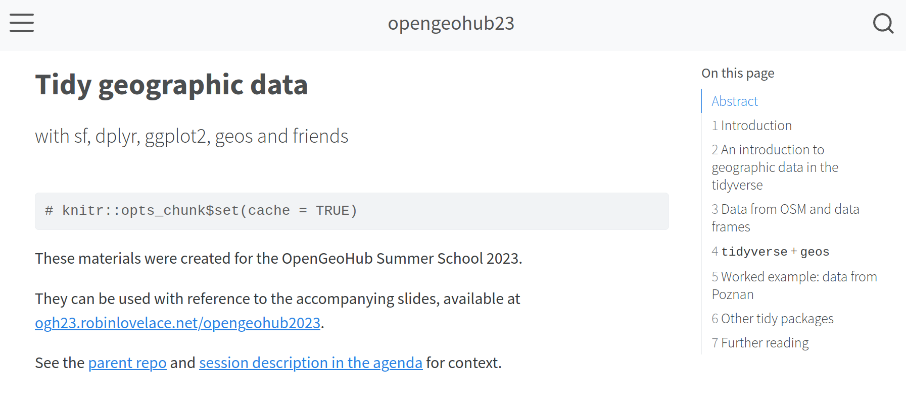

This workshop explores recent development in R's spatial data analysis ecosystem and exciting new developments in the field.

I deliver a 2 part session on 'Tidy Geographic Data', and a session on handling large OpenStreetMap datasets with R, `osmium` and other open source command-line tools.

As shown in the course [schedule](https://pretalx.earthmonitor.org/opengeohub-summer-school-2023/schedule/) I will deliver the following sessions:

-   [Tidy geographic data with sf, dplyr, ggplot2, geos and friends](https://pretalx.earthmonitor.org/opengeohub-summer-school-2023/talk/7JN3FV/)
    -   2023-08-28, 11:00--12:30, Room 21 (Sala 21)\
-   [Processing large OpenStreetMap datasets for geocomputation](https://pretalx.earthmonitor.org/opengeohub-summer-school-2023/talk/SRMZVJ)
    -   2023-09-01, 09:00--10:30, Room 18 (Sala 18)

