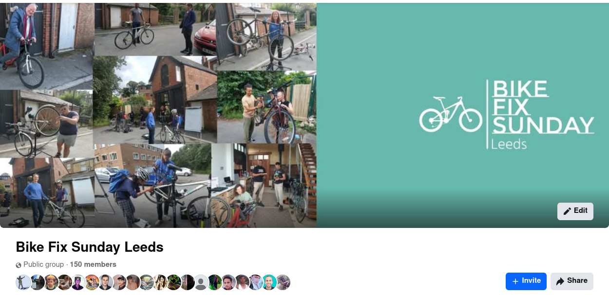
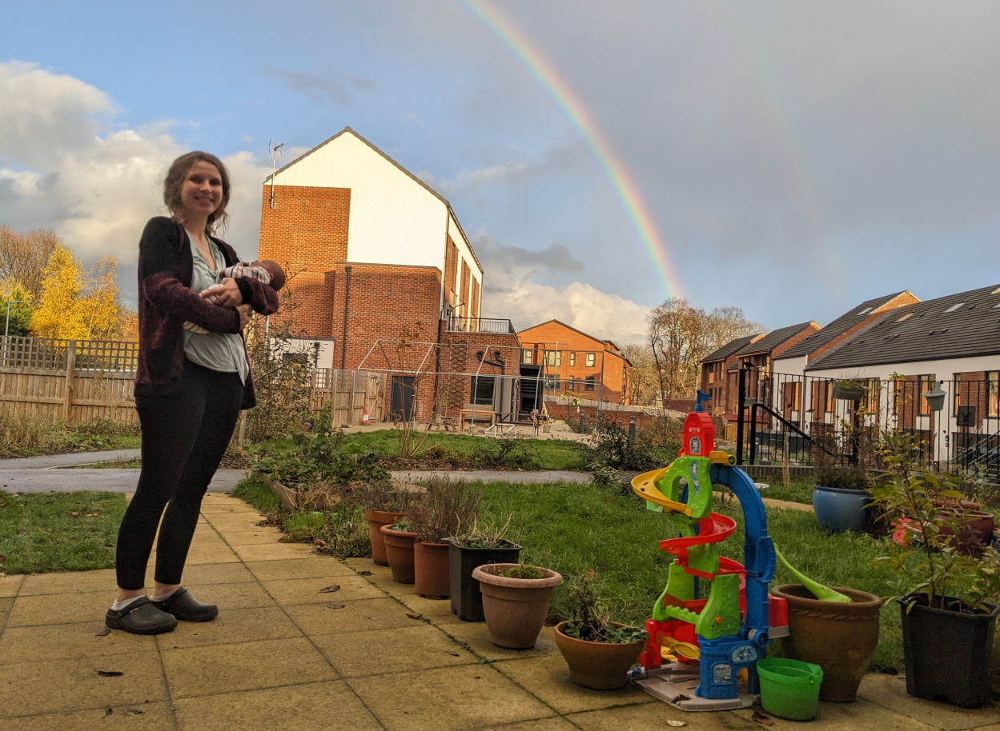
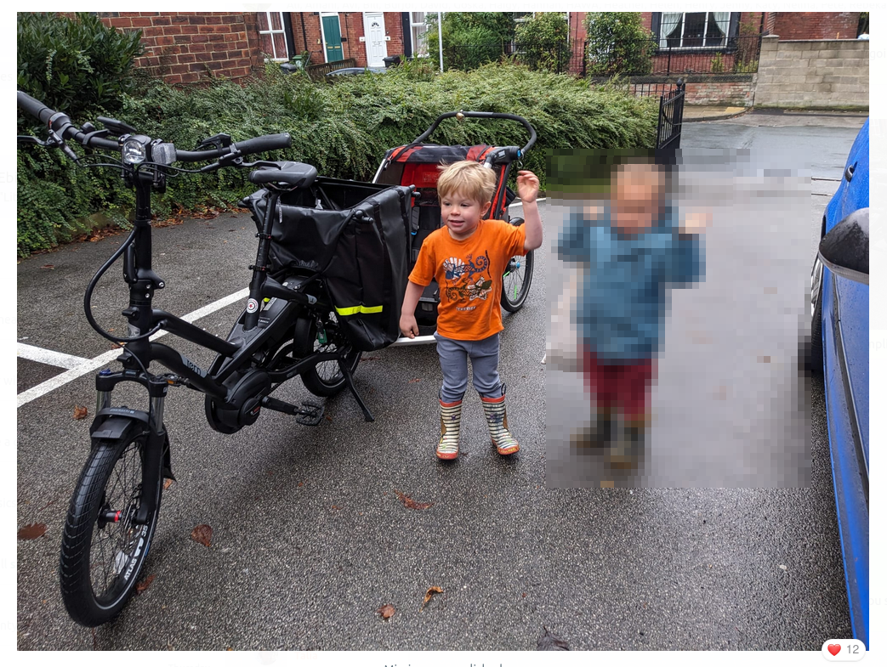
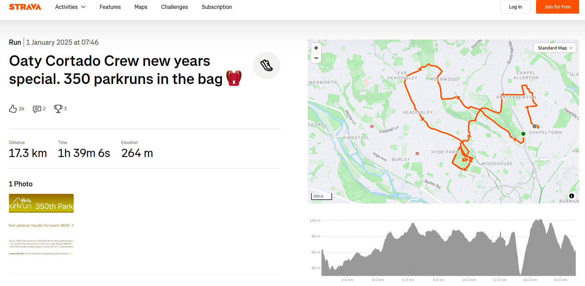
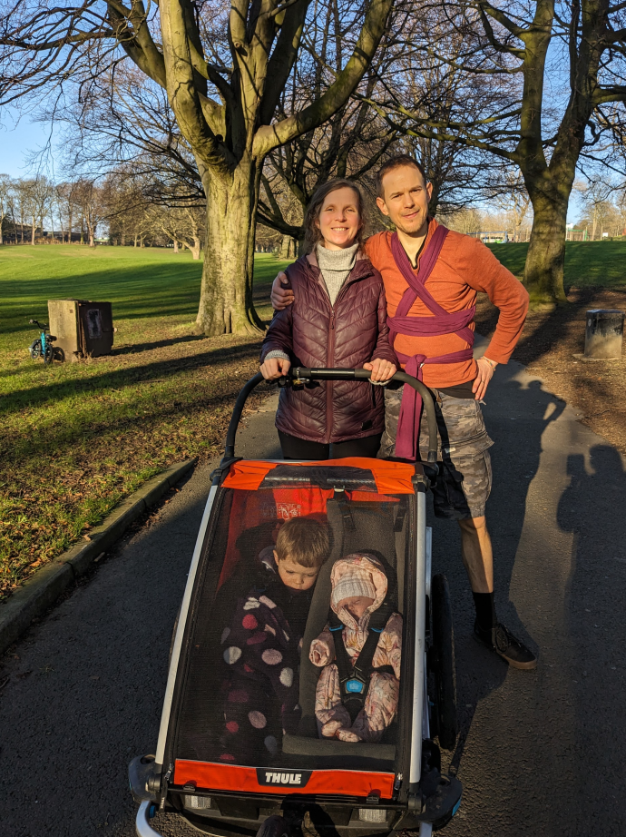

It's been another busy year, and another year of change.
In this post I'll look back on 2024 and forward to 2025.

Work-wise, I completed my contract in the [Civil Service](https://www.gov.uk/government/organisations/civil-service) where I've been working for the last 2 years in new government agency [Active Travel England](https://www.activetravelengland.gov.uk/) (note their shiny new website hosted at [activetravelengland.gov.uk](https://www.activetravelengland.gov.uk/), which has been a long timing coming).
I got a [promotion](https://www.robinlovelace.net/post/professorship/), and, from January 2025, will be back to the relative simplicity of having a single full time job.
Data-driven research, teaching, and problem-solving is my calling, and I'm looking forward to getting back to it full time at the University of Leeds.

Life-wise, I am happy to announce to the world that I've become a father, again!
My wife Katy gave birth to a beautiful baby girl, Rosa Lovelace, on Tuesday 12th November 2024.
Kit, who was born three years earlier, is being an excellent big brother.
While it inevitably led less free time and some disrupted nights in the final part of the year, it has meant the world to us as a family.

Despite all this change, I've still found time to do some fun things outside work and to participate in amazing community projects.

That's the high-level summary of what I've been up to for anyone interested in my exploits in 2024.
If you're *really* interested, read on!

# Working at Active Travel England

My 2-year contract at Active Travel England finished on the 3rd of January 2025, representing the end of a detour in my career.
As I said in a previous [post](https://www.robinlovelace.net/post/professorship/), taking the job in the Civil Service and going part-time at the University of Leeds to enable it was a big decision.

It is [well-documented](https://www.theguardian.com/higher-education-network/2017/sep/29/work-academic-professional-hybrid-role-say-goodbye-career-progression) that being an academic with a part-time job outside of academia is unusual and often challenging.
The nature of academic work lends itself to an 'all in' approach, especially when it comes to research and the pressure/expectation/enjoyment of publishing.
That 'all in' mentality wouldn't normally apply so much to the Civil Service (as outlined in [Reddit thread](https://www.reddit.com/r/TheCivilService/comments/14ga6j4/what_are_the_positives_and_negatives_of_working/) on the pros and cons of working there), but in a new and exciting government agency like ATE many I knew that many people were 100% committed to it.
(After my experience there, I would *highly* recommend working in the Civil Service to anyone who is interested in making a positive impact on society and has the skills to do so, see job opportunities at [civilservicejobs.service.gov.uk](https://www.civilservicejobs.service.gov.uk/csr/index.cgi?SID=cGFnZWNsYXNzPVNlYXJjaCZwYWdlYWN0aW9uPXNlYXJjaGNvbnRleHQmb3duZXI9NTA3MDAwMCZvd25lcnR5cGU9ZmFpciZjb250ZXh0aWQ9MTExNDU0MzU1JnJlcXNpZz0xNzM2MDg2MTMxLTUxMTE3Mjc4NGUwNDczYWQ4N2I1NDIzNzU0MDMyN2Q3ZGZkNzA0ZGQ=).)

The decision to go part time in both jobs was the right one though: it allowed me to follow-through on the belief that publicly-funded researchers owe it to society (including tax payers) to 'give back'.
Plus, the differences between academia and the Civil Service are not too big: both are knowledge-based institutions with a focus on evidence and the public good.
(In some countries such as Germany, academics are civil servants.)

More specifically, accepting the offer to work part time in a new part of central government, devoted to a topic that I am passionate about, was exciting.
Iit allowed me to build a data and digital team and help shape a rapidly-evolving organisation.
Furthermore, I knew that the role in Active Travel England would allow me to work on projects that will have huge impacts for years to come, while continuing to work with outstanding people as part of my main career in academia.

The job at ATE didn't come out of the blue.
I started working for ATE as the Director of Data and Analysis, on an interim basis in 2022.
It was a secondment from my role as a 10DS Fellow at the data science team in No 10, which was itself a secondment from the University of Leeds.
Clearly, building digital and data science capacity in government was going to be easier to deliver if I was working for government directly.
Positive societal impact has always been a key driver for me, and the opportunity to work on the Active Travel England project was too good to pass up.

My proudest achievements in ATE include:

-   Setting-up a grant funding agreement between Active Travel England and the Alan Turing Institute (see details at [turing.ac.uk](https://www.turing.ac.uk/news/alan-turing-institute-brings-data-expertise-nationwide-walking-and-cycling-schemes) and [Forbes](https://www.forbes.com/sites/carltonreid/2023/04/04/active-travel-england-partners-with-alan-turing-institute-to-leverage-data-into-investment/)) enabling the development of new digital tools for more effective transport planning, including [planning](https://plan.activetravelengland.gov.uk) (see below) and '[inspectorate](https://acteng.github.io/inspectorate_tools/)' tools, supplementing the spreadsheet-based [Active Travel England design assistance tools](https://www.gov.uk/government/publications/active-travel-england-design-assistance-tools). <!-- (Incidentally, this was the first submission that ATE sent to then new government led by Rishi Sunak after the tumultuous and short-lived Liz Truss premiership.) -->
-   Instigating the 'ATIP' project hosted at [plan.activetravelengland.gov.uk](https://plan.activetravelengland.gov.uk) (see open source code at [github.com/acteng/atip](https://github.com/acteng/atip))
-   The [SchoolRoutes](https://acteng.github.io/netgen/articles/schoolroutes.html) project, which builds on [`od2net`](https://od2net.org) and the [Propensity to Cycle Tool](https://www.pct.bike) to help local authorities identify and prioritise school routes for investment in active travel infrastructure.

# Academic exploits

In 2024 I continued to work on a range of academic projects, with the focus being on the Network Planning Tool for Scotland ([NPT](https://www.npt.scot/)), the new BICISCHOOLS project with colleagues at the University of Lisbon, and various ongoing research projects and collaborations.

Highlights included:

-   [x] Completion of two books on geographic data analysis with free and open-source programming languages for reproducible research, both of which are now with the publishers, CRC Press, are available for pre-order and will be published in 2025.
    -   [x] Geocomputation with R (second edition), a major update of the first edition, which was published in 2019.
    -   [x] Geocomputation with Python, a new book that builds on the success of the R book and applies the same principles to the Python programming language.
-   [x] Delivering a keynote at the [Mobile Tartu conference](https://www.robinlovelace.net/post/tartu2024/), and participating in the summer school that preceded it, which incidentally led to a new R package \[`spanishoddata` (see below).
-   [x] The internationalisation and extension of methods developed for the Propensity to Cycle Tool project, including:
    -   Publishing our work on the the Cycle Route Uptake and Scenario Estimation (CRUSE) project in an academic [paper](https://www.robinlovelace.net/publication/lovelace-cycle-2024/) (see [cruse.bike](https://cruse.bike/) for an interactive web app resulting from the research)
    -   [x] Completion of the [Biclar](https://www.tmlmobilidade.pt/comunicacao/noticias/biclar-tml-chama-municipios-a-debater-rumo-a-um-futuro-ciclavel/) [web application](https://u-shift.github.io/biclarwww/) and paper, published in Computers, Environment and Urban Systems ([CEUS](https://www.sciencedirect.com/science/article/pii/S0198971522000731)) describing the underlying methods.
-   [x] Participating in the Spatial Data Science across Languages ([SDSL](https://spatial-data-science.github.io/2024/)) conference, which was held in-person in Prague in September 2024.

# My year in open source

In 2024 I continued to contribute to open source projects, including:

-   [x] Developing a simple R interface to the [`od2net`](https://od2net.org) Rust crate, which can generate route networks for OD data in a fraction of the time of other approaches.
    -   [x] This work was part of the the SchoolRoutes project, see the [acteng/netgen](https://acteng.github.io/netgen/) package for more details.
-   [x] Instigating and co-authoring the new [`spanishoddata`](https://github.com/ropenspain/spanishoddata) R package, which enables reproducible scientific research and discovery in mobility and other fields based on the world's first open access and high-resolution national origin-destination dataset (thanks to the Spanish government for making this data open access and for Egor Kotov who led the development of the package after we met at the Mobile Tartu conference).
-   [x] Contributing to the [`parenx`](https://github.com/anisotropi4/parenx) Python package, now on `pip` which provides functions for simplification of geographic representations of transport networks.
-   [x] Work on software for joining spatial networks, including improvements to the [`stplanr::rnet_join()`](https://docs.ropensci.org/stplanr/reference/rnet_join.html) function and contributions to the [`anime`](https://github.com/josiahparry/anime) (Approximate Network Integration, Matching and Enrichment) package for fast and flexible linestring matching in R, Rust and (hopefully soon) other languages.

See my [GitHub profile](https://github.com/robinlovelace) for more details on my open source work.

# Community projects

All that time in front of the computer, Working on all three jobs --- as Lead Data Scientist at Active Travel England, an academic at the University of Leeds, and as an author and maintainer of open source software --- involved a lot of screen time.
The perfect antidote to that is getting outside and doing things with other people and 2024 was pretty strong in that regard.
I had three main outlets for my outdoorsy and social side in 2024: the community-run [Bike Fix Sunday](https://bikefs.org/) project to help people fix their bikes in the local community, the Chapeltown Cohousing community-led housing project where I live, and the 'Oaty Cortado run club'.

These were a fun and rewarding outlet during downtime from work and family life and, as the photos below convey, were great fun.

## Bike fix Sunday

See the [Bike Fix Sunday](https://bikefs.org/) website for more details on the project, which is a great way to meet people in the local community and help people fix their bikes.

## Chapeltown Cohousing

[Chapeltown Cohousing](https://www.chapeltowncohousing.org.uk/) is a cohousing project in Leeds.
It's a great place to live, with a decent amount of outdoor space that is ideal for children to run around in without the danger of the roads.

Other than simply living there and chatting to our amazing neighbours, I've got involved in a few initiatives there, including getting a shared electric cargo bike, thanks to a grant from the [Leeds Community Climate Grant](https://www.leeds.gov.uk/community-climate-grants) initiative.

## Oaty Cortado run club

This isn't an official run club, just a group of mates who go for a coffee once a week or so, and fit in some runs too!
I'm not on Strava much, but having seen the impressive [activity](https://www.strava.com/activities/13236925876) on there from Oaty Cortado run club member [Bobak Champion](https://www.bobakchampion.co.uk/), getting more involved in running and encouraging more people to do so seems a worth New Year's resolution!

I'd also like to go on more runs with the little runs: baby Rosa is yet to do a run in the buggy but that should change in 2025!

Family run with the little ones in the bike trailer / running buggy

# Thoughts on 2025

2025 is going to be a big year.
I'm looking forward to it all, getting cranking in my new role at the University of Leeds and having more bandwidth with only one job, continuing to have a good work-life balance, and seeing how the kids grow up.

With the extra bandwidth allowed by the completion of my work at Active Travel England, I'm also open to opportunities, so if you would like to get in touch about a project or collaboration, please do so in the comments below, via the [contact form](https://www.robinlovelace.net/#contact), or via email.

Happy New Year to all from me and family, I hope to hear from many of you in 2025!

 
