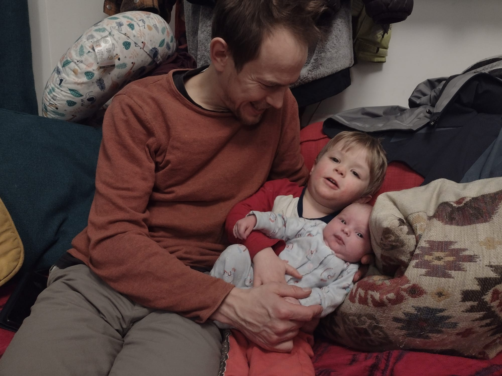

It's been another busy year, and another year of change.
In this post I'll look back on 2024 and forward to 2025.

Work-wise, I completed my contract in the Civil Service where I've been working for the last 2 years in new government agency Active Travel England.
I got a promotion, and, from January 2025, will be back to the relative simplicity of having a single full time job.

Life-wise, I am happy to announce to the world that I've become a father, again!
My wife Katy gave birth to a beautiful baby girl, Rosa Lovelace, on Tuesday 12th November 2024.
Kit, who was born three years earlier, is being an excellent big brother.
While it inevitably led less free time and some disrupted nights in the final part of the year, it has meant the world to us as a family.

Despite all this change, I've still found time to do some fun things outside work and to participate in amazing community projects.

That's the high-level summary of what I've been up to for anyone interested in my exploits in 2024.
If you're *really* interested, read on!

# Working at Active Travel England

My 2-year contract at Active Travel England finished on the 3rd of January 2025, representing the end of a detour in my career.
As I said in a previous post, taking the job in the Civil Service and going part-time at the University of Leeds to enable it was a big decision.

It is well documented that being an academic with a part-time job outside of academia is unusual and often challenging.
The nature of academic work, which many people including me find rewarding and at times more of a vocation than a job, lends itself to an 'all in' approach, especially when it comes to research and the pressure/expectation/enjoyment of publishing.
That 'all in' mentality wouldn't normally apply so much to the Civil Service, but in a new and exciting government agency like ATE many I knew that many people were 100% committed to it.

The decision to go part time in both jobs was the right one though: it allowed me to follow-through on the belief that publicly-funded researchers owe it to society (including tax payers) to 'give back'.
(In some countries such as Germany, academics are civil servants.)
And more specifically, it allowed me to build a team in an exciting organisation and work on projects that will have huge impacts for years to come, while continuing to work with outstanding people as part of my main career in academia.

The job at ATE didn't come out of the blue.
I started working for ATE as the Director of Data and Analysis, on an interim basis in 2022.
It was a secondment from my role as a 10DS Fellow at the data science team in No 10, which was itself a secondment from the University of Leeds.
Clearly, building digital and data science capacity in government was going to be easier to deliver if I was working for government directly.
Positive societal impact has always been a key driver for me, and the opportunity to work on the Active Travel England project was too good to pass up.

My proudest achievements in ATE include:

- Setting-up a grant funding agreement between Active Travel England and the Alan Turing Institute (see details at [turing.ac.uk](https://www.turing.ac.uk/news/alan-turing-institute-brings-data-expertise-nationwide-walking-and-cycling-schemes) and [Forbes](https://www.forbes.com/sites/carltonreid/2023/04/04/active-travel-england-partners-with-alan-turing-institute-to-leverage-data-into-investment/)) enabling the development of new digital tools for more effective transport planning, including [planning](https://plan.activetravelengland.gov.uk) (see below) and '[inspectorate](https://acteng.github.io/inspectorate_tools/)' tools, supplementing the spreadsheet-based [Active Travel England design assistance tools](https://www.gov.uk/government/publications/active-travel-england-design-assistance-tools).
<!-- (Incidentally, this was the first submission that ATE sent to then new government led by Rishi Sunak after the tumultuous and short-lived Liz Truss premiership.) -->
- Instigating the 'ATIP' project hosted at [plan.activetravelengland.gov.uk](https://plan.activetravelengland.gov.uk) (see open source code at [github.com/acteng/atip](https://github.com/acteng/atip))
- The [SchoolRoutes](https://acteng.github.io/netgen/articles/schoolroutes.html) project, which builds on [`od2net`](https://od2net.org) and the [Propensity to Cycle Tool](https://www.pct.bike) to help local authorities identify and prioritise school routes for investment in active travel infrastructure.

# Academic exploits

In 2024 I continued to work on a range of academic projects, with the focus being on the Network Planning Tool for Scotland ([NPT](https://www.npt.scot/)), the new BICISCHOOLS project with colleagues at the University of Lisbon, and various ongoing research projects and collaborations.

Highlights included:

- [x] Completion of two books on geographic data analysis with free and open-source programming languages for reproducible research, both of which are now with the publishers, CRC Press, are available for pre-order and will be published in 2025.
  - [x] Geocomputation with R (second edition), a major update of the first edition, which was published in 2019.
  - Geocomputation with Python, a new book that builds on the success of the R book and applies the same principles to the Python programming language.
- [x] Attending and delivering a keynote at the [Mobile Tartu conference](https://www.robinlovelace.net/post/tartu2024/).
- The internationalisation and extension of methods developed for the Propensity to Cycle Tool project, including:
  - Publishing our work on the the Cycle Route Uptake and Scenario Estimation (CRUSE) project in an academic [paper](https://www.robinlovelace.net/publication/lovelace-cycle-2024/) (see [cruse.bike](https://cruse.bike/) for an interactive web app resulting from the research)
  - Completion of the [Biclar](https://www.tmlmobilidade.pt/comunicacao/noticias/biclar-tml-chama-municipios-a-debater-rumo-a-um-futuro-ciclavel/) [web application](https://u-shift.github.io/biclarwww/) and paper, published in Computers, Environment and Urban Systems ([CEUS](https://www.sciencedirect.com/science/article/pii/S0198971522000731)) describing the underlying methods.

- Participating in the Spatial Data Science across Languages ([SDSL](https://spatial-data-science.github.io/2024/)) conference, which was held in-person in Prague in September 2024.

<!-- 

# My year in open source

# Community projects

# Thoughts on 2025

# References

 -->
